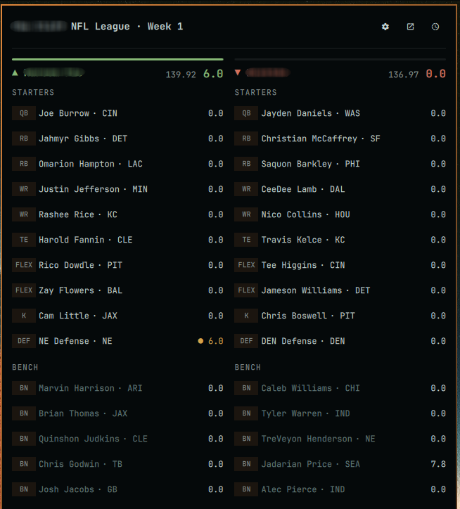
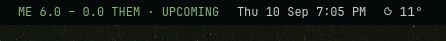

# Omarchy Sleeper Fantasy Matchup Plugin

A theme-aware Omarchy bar widget for live Sleeper fantasy football matchups.

The compact bar score opens a two-column matchup panel containing teams, starters, bench players, positions, NFL teams, and live fantasy points. It uses Omarchy's active font and theme tokens, with optional performance and monochrome colour modes.

## Preview



The compact menubar view keeps the current matchup visible at a glance:



## Requirements

- Omarchy 4.x with `omarchy-shell`
- `curl`
- `jq`
- A public Sleeper fantasy football league

Sleeper's read-only league API does not require authentication.
Because `curl` and `jq` are external system dependencies, the marketplace may classify the plugin as requiring manual setup until they are installed.

## Install

```bash
omarchy plugin add https://github.com/nugget210/oma-sleeper.git --enable
```

Omarchy installs the plugin as `nugget210.oma-sleeper`. Choose a bar position when prompted.

## Set up

1. Click `NFL SETUP` in the bar.
2. Open the cog if the settings view is not already visible.
3. Paste a Sleeper league URL or numeric league ID and select **Update**.
4. Select your fantasy team.
5. Optionally enter a short bar label, choose a colour mode, and choose the score detail shown for players.
6. Select **Save**.

No league, roster, team name, or bar label is included in the plugin defaults.

## Controls

- Left click: open or close the matchup panel
- Middle click: refresh matchup data
- Cog: settings
- External-link icon: open the matchup on Sleeper
- Refresh icon: refresh immediately

## Live matchup data

During games, each active player shows the NFL quarter, clock, and a progress rail. With at least two prior league weeks available, the current score is compared with that player's rolling fantasy average at the same game progress: green/`▲` is above pace, orange/`●` is near pace, and urgent red/`▼` is below pace. Pregame and insufficient-history states remain neutral.

Each team header shows its projected final score beside its current score. Projections use Sleeper's weekly player data and the league's scoring settings; while a game is live, points already earned are combined with the unplayed share of the player's projection. Projection data refreshes alongside matchup scores, including every 60 seconds during live games.

Before the round begins, team and player scores remain at zero while the team headers continue to show the full projected lineup totals. Preseason NFL results are excluded from regular-season matchup state.

The compact bar derives matchup state from the NFL games attached to both starting lineups. It shows `UPCOMING` while starter games are scheduled and `● LIVE` when any starter is playing. Completed slates have no status suffix for now. If schedule data is unavailable, no status suffix is shown rather than guessing.

Player metadata is cached once per day in `~/.cache/oma-sleeper` because Sleeper recommends fetching the full NFL player map sparingly. League, user, and roster metadata is cached for one hour. Pace comparisons use at most the four previous matchup weeks. Matchup scores use adaptive refresh intervals:

- 60 seconds while an NFL game is live
- 5 minutes when a game starts within three hours
- 15 minutes while the slate is idle or completed
- Immediately when the panel opens, the refresh button is selected, or the computer wakes

Sleeper remains the source of all fantasy data. The public ESPN NFL scoreboard supplies only the live/upcoming/idle game-clock signal used to choose a refresh interval.

## Resource safety

All remote responses have endpoint-specific download and collection limits and must pass a JSON schema check before use. League IDs, NFL weeks, seasons, roster IDs, player IDs, names, and score collections are type-checked and bounded. The cache directory is opened once and all writes remain anchored to that directory descriptor. Cached inputs are hard-linked into a private per-run directory so validation and later processing use the same inode; validated downloads are atomically renamed from unique temporary files. Cache directories are owner-only.

The generated QML payload is capped at 2 MiB and the interface renders at most 64 teams, 32 starters, and 32 bench players per team. Remote and user-provided strings are rendered explicitly as plain text. Optional home/opponent labels have a 24-character limit at both input and persistence boundaries, with control characters removed before they enter `shell.json`.

## Colour modes

- **Theme-aware** uses the current Omarchy accent, foreground, muted, popup, and urgent colours.
- **Performance** adds green leader emphasis while retaining Omarchy's urgent colour for the trailing team.
- **Minimal** keeps the scoreboard monochrome.

Pregame and tied matchups remain neutral. Colour is reinforced by score rails and directional symbols rather than being the only indicator.

## Score detail modes

- **Full** shows live clocks, game-progress rails, pace colours, and pace symbols.
- **Scores only** shows plain player names and scores, and also removes the team comparison rail, colours, and directional symbols.
- **Game progress** keeps neutral clocks and progress rails but removes player pace styling.
- **Pace only** keeps player pace colours and symbols but removes clocks and progress rails.

The score detail and colour settings are independent. For the quietest presentation, use **Scores only** with **Minimal** colours.

## Update

Git-managed installations can be updated with:

```bash
omarchy plugin update nugget210.oma-sleeper
```

## Uninstall

Remove the plugin with:

```bash
omarchy plugin remove nugget210.oma-sleeper
```

## Data source

League, roster, matchup, and player information comes from the public [Sleeper API](https://docs.sleeper.com/).

## License

[MIT](LICENSE)
