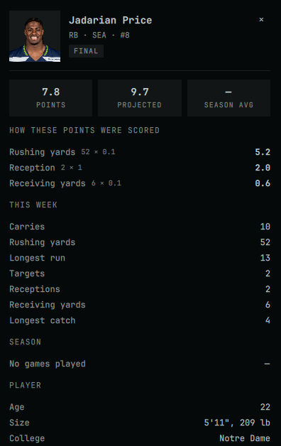

# Sleeper Matchup

A theme-aware Omarchy bar widget for live Sleeper fantasy football matchups.

The compact bar score opens a two-column panel showing both lineups, live game clocks, projected totals, and a per-player breakdown of exactly how each score was earned.


It sits in the bar as a single score, so the matchup stays visible without opening anything:


## Requirements

- Omarchy 4.x with `omarchy-shell`
- `curl`, `jq`, and Python 3
- A public Sleeper fantasy football league — Sleeper's read-only API needs no login or key
- Optional, for alerts: an audio player (`pw-play`, `paplay`, `aplay`, or `ffplay`) and `notify-send`

## Install

```bash
omarchy plugin add https://github.com/nugget210/oma-sleeper.git --enable
```

Then click **NFL SETUP** in the bar, paste a Sleeper league URL or numeric league ID, select **Update**, choose your team, and **Save**. No league, roster, or team name ships in the defaults.

## Update

```bash
omarchy plugin update nugget210.oma-sleeper
```

## Uninstall

```bash
omarchy plugin remove nugget210.oma-sleeper
```

## Features

- **Live scoreboard** — both lineups side by side, starters and bench, with positions, NFL teams, and live fantasy points.
- **Live highlighting** — every player whose NFL game is on right now gets a tinted row, an accent edge, and a slow pulse, so you can see at a glance who is currently earning points. Team defences too.
- **Game clocks** — active players show the quarter, the clock, and a progress rail.
- **Projected totals** — each team header shows its projected final score, composed the way the Sleeper app composes it: points already banked plus a projection for every player yet to kick off.
- **Pace arrows** — once a game is a tenth played, `▲` / `●` / `▼` show whether a starter is running above, on, or below the share of their projection the game has reached.
- **Scoring breakdown** — the player card itemises what earned the points, in plain English, against your league's own scoring rules.
- **Alerts** — optional sounds and desktop notifications for scoring plays and lead changes.
- **Adaptive refresh** — 60 seconds while a game is live, 5 minutes when kickoff is within three hours, 15 minutes otherwise, and immediately when the panel opens or the machine wakes.

## The player card

Click any player or defence in either lineup — starter or bench — to open their detail card.



| | |
|---|---|
| **Headline numbers** | Points this week, projection, and season average in your league's scoring. |
| **How these points were scored** | One line per scoring rule the player triggered, showing the count against your league's rate and the points it produced — `Shutout 1 × 10 → 10.0`, `Passing yards 245 × 0.04 → 9.8`. Derived from your league's settings, so it follows any change your commissioner makes. |
| **Game status** | `● LIVE · Q3 4:12` with a progress rail, or `FINAL`, or `YET TO PLAY`. |
| **This week** | The box score lines that apply to the position — completions and passing yards for a quarterback, sacks and yards allowed for a defence. |
| **Season** | Games played and total points in your league's scoring. |
| **Player** | Age, size, college, experience, and depth-chart position. |

Photos come from Sleeper's public CDN, cached for 30 days, with a team defence resolving to its team logo and a position badge as fallback.

## Options

Open the cog in the panel.

| Option | Choices | Default |
|---|---|---|
| League | Sleeper league URL or numeric ID | none |
| Fantasy team | your team in that league | none |
| Bar label | short name shown in the bar | none |
| Colour mode | **Theme-aware**, **Performance** (green leader), **Minimal** (monochrome) | Theme-aware |
| Score detail | **Full**, **Scores only**, **Game progress**, **Pace only** | Full |
| Score alert | **Off**, **Ding**, **Chime**, **Blip** — plays when a starter gains points | Ding |
| Lead change alert | on / off — a rising three-note tone when you take the lead, falling when you lose it | on |
| Desktop notifications | on / off — names the scorer and the gain with the current score line | on |

Colour mode and score detail are independent. For the quietest presentation, use **Scores only** with **Minimal**.

Alerts are deliberately conservative: the first refresh after opening, changing league, or switching team only establishes a baseline, so you never hear points already on the board. Stat corrections and lineup changes stay silent, and a multi-monitor bar raises one alert per event rather than one per screen. On a host with no audio player or `notify-send`, alerts are simply silent.

## Controls

- **Left click** — open or close the panel
- **Middle click** — refresh
- **Cog** — settings
- **External-link icon** — open the matchup on Sleeper
- **Refresh icon** — refresh immediately

## Data and privacy

All fantasy data comes from the public [Sleeper API](https://docs.sleeper.com/). The public ESPN NFL scoreboard supplies only the game-clock signal used to decide the refresh interval and to mark games live. Nothing is sent anywhere else, and no credentials are involved. Responses are cached under `~/.cache/oma-sleeper` in a directory owned by and readable only by you.

## Development

```bash
for t in tests/test-*.sh; do bash "$t"; done
```

## License

[MIT](LICENSE)
